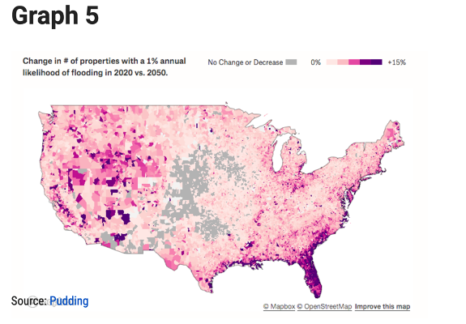
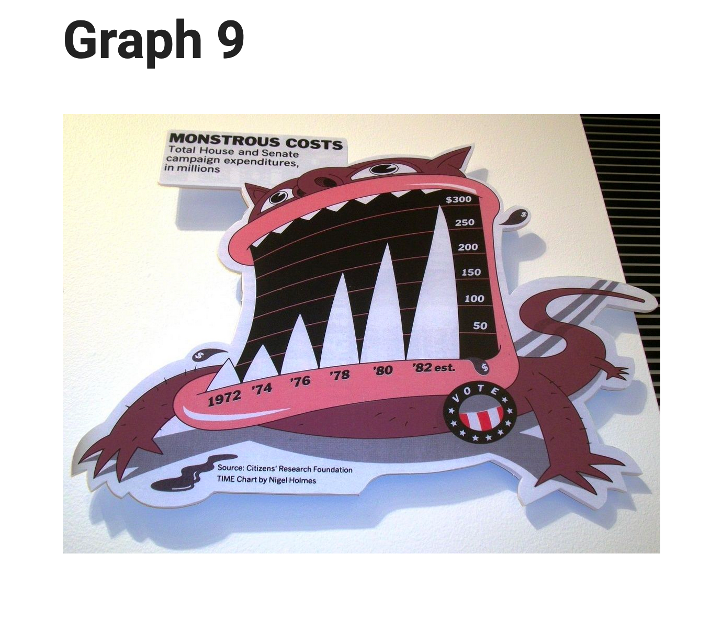
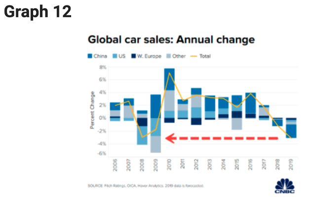
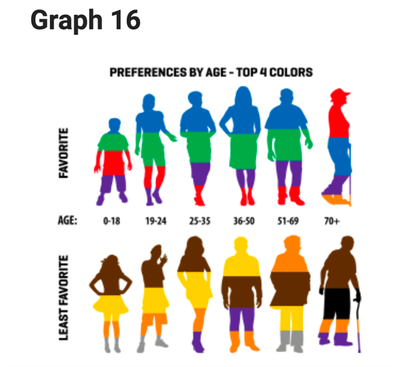

1.	Whether you feel the chart is good or bad: I feel this chart is bad, the title and legend bring some confusion to me.

2.	A criticism of the chart: 

* For the legend: “no change” should be the same color of 0%. In the chart, some part are white and some are gray. It doesn’t make sense to differentiate “no change” and “increasing 0%” . 

* The title of the chart said 2020 vs. 2050, but from the chart, readers may feel hard to identify this is 2020 or 2050. This may bring some confusion. 

3.	Ways to improve the chart

* Change the legend. Let gray color be “decrease” and remove “no change” from gray legend. 

* Add a year label at the bottom of the map graph, let people know this graph is for year 2050. 

1.	Whether you feel the chart is good or bad: I like the creativity design of using “teeth-shape” to represent bar chat. But I also feel the graph may also bring misleading information due to the triangle bar shape. 

2.	A criticism of the chart

* The teeth-shape bar makes me feel the middle part represent higher value while the left and right sides represent lower value. For example, I may feel 82’ and 84’ have lower value than 83’. 

3.	Ways to improve the chart

* Change the teeth bar shape to normal bar chart shape. 

1.	Whether you feel the chart is good or bad: I feel the char is bad, because too much information are in this chart but the mixture of information may bring confusion. 

2.	A criticism of the chart

* Since these are time series data. It will be more clear to use line chars to represent different counties instead of stacked bar. 

* Actually, I didn’t know what information the red arrow want to tell without any explanation.  

3.	Ways to improve the chart

* Change the stacked bar chart to line chart with different color represent different countries. 

* Remove the red arrow

1.	Whether you feel the chart is good or bad: I feel bad about the chart

2.	A criticism of the chart

* I cannot understand the purple color appears in both top 4 favorite and least favorite colors in age 25-35 and 36-50. 

* I guess gender may affect the preference of colors. But I’m not sure if this charts considered gender factor, because the figures include both male and female in the same row. 

* The sizes of areas different colors may misleading:  larger area may represent larger proportion. 

3.	Ways to improve the chart: 

* Use bar chart to represent the preference, the length of each bar represent the preference level. 

* Draw 2 charts, one is for male and another is for female

