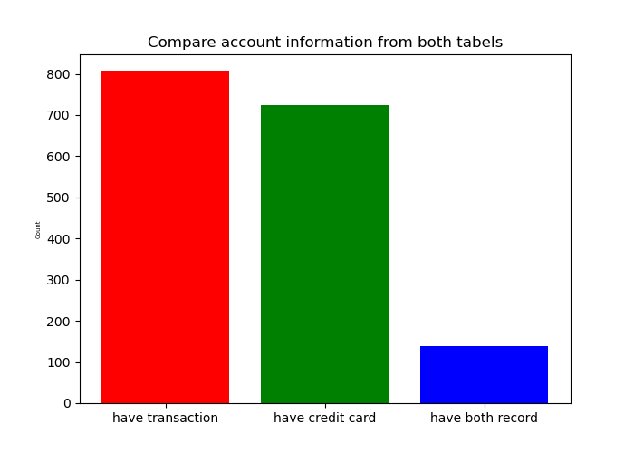

```{r setup, echo=FALSE, include=FALSE}
library(ggplot2)
library(dplyr)
library(tidyverse)
library(ggpubr)
library(scales)
library(base)
library(lubridate)
library(xts)
library(astsa)
library(tseries)

```

#### Task 1. Explore all accounts. Create visualizations that combine or these account characteristics:

* Whether an account has a credit card or not

* Whether an account has a loan or not

* The average balance for the account

Exploration ： 
```{r,echo=FALSE, warning=FALSE, message=FALSE, fig.align='center'}
account=read.csv('/Users/qianyi/Desktop/Data/accounts_analytical.csv')
transaction=read.csv('/Users/qianyi/Desktop/Data/transactions.csv')

df1=account[c('account_id', 'credit_cards')]
df1['credit_cards'][is.na(df1['credit_cards'])] <- 0 # convert null value into 0 
df1['has_credit_cards']=data.frame(df1['credit_cards']>0)

# bar chart 
graph1=ggplot(data = df1,mapping = aes(x=has_credit_cards)) +
  geom_bar(mapping=aes(fill=as.factor(has_credit_cards)),show.legend = FALSE)+
  scale_fill_manual(values=c("#389693", "#E69F00", "#56B4E9"))+
  theme_minimal()+
  labs(x='Have credit cards',y='Count of accounts',title='Whether has credit cards')
  

df2=account[c('account_id', 'loan_amount')]
df2['loan_amount'][is.na(df2['loan_amount'])]=0 
df2['has_loan']=data.frame(df2['loan_amount']>0)
t1=table(df2$has_loan)
df2.2=data.frame(has_loan=c(FALSE, TRUE), count=c(table(df2$has_loan)[1],table(df2$has_loan)[2]))

# pie chart 
graph2=ggplot(data=df2.2,mapping=aes(x='',y=count,fill=has_loan))+
  geom_bar(width = 1, stat = "identity")+
  coord_polar(theta='y')+
  theme_minimal()+
  theme(axis.text = element_blank(),
        axis.ticks = element_blank(),
        panel.grid  = element_blank())+
  geom_text(aes(label = percent(count/nrow(df2)[1])), size=5)+
  labs(title='Whether has loans',y='',x='')+ guides(fill=guide_legend(title="Whether has loan"))

# max_balance & min_balance 
transaction=transaction %>% select(-c('id'))
avg_balance=transaction %>% select(c(account_id, balance)) %>% group_by(account_id) %>% summarise(avg_balance=mean(balance))
df3=account %>% left_join(avg_balance, on='account_id')
df3=df3[c('account_id', 'avg_balance')]

# histogram of avg_balance 
graph3=ggplot(data=df3,mapping=aes(x=avg_balance))+
  geom_histogram(binwidth = 50,color='darkgreen')+
  theme_minimal()+
  labs(x='Avgerage Balance for Accounts',y='Count',title='Histogram of the Average Balance for Accounts')

# combine 3 polt together 
ggarrange(graph3, ggarrange(graph1, graph2, ncol = 2), nrow = 2)
```

* From the exploration, we can see that most accounts did not have credit card, most accounts did not have loans. The distribution of average balance of accounts is right skewed. 

#### Visualize with facet: explore the average balance for accounts with/without loan and with different number of credit cards 
```{r, echo=FALSE, warning=FALSE, message=FALSE, fig.align='center'}
avg_balance=transaction %>% select(c(account_id, balance)) %>% group_by(account_id) %>% summarise(avg_balance=mean(balance))
df_t12=account %>% left_join(avg_balance, by='account_id')
df_t12=df_t12[c('account_id', 'avg_balance','loan_amount', 'credit_cards')]
df_t12['credit_cards'][is.na(df_t12['credit_cards'])]='0 credit cards'
df_t12['credit_cards'][df_t12['credit_cards']==1,]='1 credit cards'
df_t12['credit_cards'][df_t12['credit_cards']==2,]='2 credit cards'
df_t12['loan_amount'][!is.na(df_t12['loan_amount'])]='Has Loan'
df_t12['loan_amount'][is.na(df_t12['loan_amount'])]='No Loan'


ggplot(data=df_t12, mapping=aes(x=account_id, y=avg_balance))+
  geom_point(mapping=aes(color=loan_amount))+
  facet_wrap(~credit_cards)+
  labs(x='account ID', y='average balance for the account')
```

* Most account did not have credit cards. Very limited accounts have both credit cards and loans. 

#### Task 2. What is the distribution of all loans and what are their characteristics?

```{r, echo=FALSE, warning=FALSE, message=FALSE, fig.align='center'}
account=read.csv('/Users/qianyi/Desktop/Data/accounts_analytical.csv')
transaction=read.csv('/Users/qianyi/Desktop/Data/transactions.csv')
df4=account[c('account_id','loan_date','loan_amount','loan_payment', 'loan_term','loan_status','loan_default')]

# distribution of loan amount
graph4=ggplot(data=df4,mapping=aes(x=loan_amount))+
  geom_histogram(binwidth = 2000, color='darkblue')+
  labs(x='Loan Amount',y='Count',title='Distribution of Loan Amount')

# distribution of loan payment
graph5=ggplot(data=df4,mapping=aes(x=loan_payment))+
  geom_histogram(binwidth = 50, fill='darkred')+
  labs(x='Loan payment',y='Count',title='Distribution of Loan Payment')

# pie chart of loan term 
df4['loan_term'][is.na(df4['loan_term'])] <- 'NA'
t2=data.frame(table(df4$loan_term))
require("ggrepel")

theme_set(theme_minimal())
graph6=ggplot(data=t2,mapping=aes(x='',y=Freq,fill=Var1))+geom_bar(width=1, stat='identity')+
  coord_polar(theta='y',start=0)+
  labs(title ='Pie chart of Term Types',y='',x='')+
  theme(legend.title = element_blank(), 
        legend.direction = "horizontal",
        axis.text = element_blank(),
        axis.ticks = element_blank(),
        panel.grid  = element_blank())+
  scale_fill_viridis_d()

# loan status 
df4['loan_status'][df4['loan_status']==''] <- 'NA'
graph7=ggplot(data=df4,mapping=aes(x=loan_status,fill=loan_status))+
  geom_bar(show.legend = FALSE)+
  scale_fill_manual(values=c("#213213", "#E46311", "#B6B2E1"))+
  labs(x='Loan Status',y='Count of Status',title='Loan Status Character',size=1)

# loan_default 
df4['loan_default'][is.na(df4['loan_default'])] <- 'NA'

graph8=ggplot(data=df4,mapping=aes(x=loan_default,fill=loan_default))+
  geom_bar(show.legend = FALSE)+
  scale_fill_manual(values=c("#289213", "#B42381", "#E6B5E1"))+
  labs(x='Loan Default',y='Count',title='Loan Default Character')


# combine graphs for problem 2 
ggarrange(graph4, graph5, graph7, graph8, graph6, ncol = 2, nrow=3)

```

#### What is the distribution of all loans and what are their characteristics?

* According to these visualization plots, the distribution of all loan amount is right skewed. 

* The loan payment is also right skewed.The characteristic is that: both loan amount and loan payment amount are more likely to be relatively smaller number. This is reasonable due to the risk control of banks. 

* For other characteristics, relatively more accounts have current loan instrad of expried loan. Besides, more accounts with loan are not in default, which means most of them are good loans. For loan terms, among the accounts with records, surprisingly, the differendt loan terms have almost equally proportions. 

#### Task 3. Is there a relationship between a good or bad loan and the time between an account is opened an the loan is created? 

* Is there a specific set of accounts that seem to be at higher or lower risk of defaulting?
```{r, echo=FALSE, warning=FALSE, message=FALSE, fig.align='center'}
# bad loan --> loan_default=True 
# compare the distribution of num_days between bad loan and good loan 
# compare the box plot 
df5=account[c('account_id', 'acct_creation_date', 'loan_date', 'loan_default')]
df5=df5 %>% drop_na() # drop the NA value 
start <- as_date(df5$acct_creation_date)
end<- as_date(df5$loan_date)
date_diff<-as.data.frame(as.integer(end-start))
df5['date_diff']=date_diff
# bad loans 
df5_bad=df5[which(df5$loan_default==TRUE),]
# good loans 
df5_good=df5[which(df5$loan_default==FALSE),]
```

```{r, echo=FALSE, warning=FALSE, message=FALSE, fig.align='center'}
# plot bad loan date diff histogram 
graph9=ggplot(data=df5_bad, mapping=aes(x=date_diff))+
  geom_histogram(binwidth = 25, fill='orange')+
  labs(x='date difference', y='Count', title='Bad Loans date difference distribution')

# plot good loan date diff histogram 
graph10=ggplot(data=df5_good, mapping=aes(x=date_diff))+
  geom_histogram(binwidth = 25, fill='orange')+
  labs(x='date difference', y='Count', title='Good Loans date difference distribution')

graph11=ggplot(data=df5, mapping=aes(x=loan_default, y=date_diff, fill=loan_default))+
  geom_boxplot()+
  labs(x='Whether a bad loan', y='date difference', title='compare date difference between bad and good loans')

ggarrange(graph11, ggarrange(graph9, graph10, ncol=2), nrow=2)
```

* Bad loans are likely to have smaller value od date difference between open account and create loan. 

* According to the comparison, good loans have higher frequency of longer date difference than bad loans. This means, if the the date difference between account open and loan created is small, then it may have higher risk of being bad loan. 

#### Task 4. For the account with the highest number of transactions, make a time series line plot for the behavior of the account over time, including all debits and credits, the different methods, and the with the different categories.

```{r, echo=FALSE, warning=FALSE, message=FALSE, fig.align='center'}
# find the account with highest number of transactions 
df6=transaction %>% group_by(account_id) %>% count()
df6.1=df6[which(df6$n==max(df6$n)),] # the account_id with maximun transactions(675) is account_id=8261
# extract all transaction records for account 8261
df6.2=transaction[which(transaction$account_id==8261),]
```


```{r, echo=FALSE, warning=FALSE, message=FALSE, fig.align='center'}
par(mfrow=c(2,1))
# date and amount 
plot(ts(df6.2$amount), xlab='transaction records', ylab='transaction amount')
# date and balance 
plot(ts(df6.2$balance), xlab='transaction records', ylab='balance amount')

```

* From the time series, we could see that this account had fluctuated balance amount over time. This is because that the transaction amount was not very stable. 

#### Task 5. Explore the validity of the data for the case whether or not an account has a credit card and whether or not they have associated credit card transactions. Is there anything worth noting?

```{r,echo=FALSE, warning=FALSE, message=FALSE, fig.align='center'}
# find all credit card transactions 
df7=transaction[which(transaction$method=='credit card'),] 
# find the distinct account_id 
df7.1=df7 %>% group_by(account_id) %>% count() #807 rows, there are 807 accounts have associated credit card transactions 

# find all the accounts with credit cards 
df8=account[which(account$credit_cards>0),] %>% group_by(account_id) # 725 rows, there are 725 accounts have credit cards 
df8=df8 %>% select(c('account_id', 'credit_cards'))
# join the information 
df9=df8 %>% full_join(df7.1, by = "account_id") %>% drop_na() #139 rows have both credit card records and transaction records 

# Problem 
# not all the accounts with credit cards have records of credit card transaction; 
# not all the credit card tranactions have records of the credit card associated with the account id. 
df10=data.frame(x=c('have credit card transaction','have credit cards','have credit card & transaction'), count=c(nrow(df7.1),nrow(df8),nrow(df9)))

ggplot(data=df10,mapping=aes(x=x,y=count, fill=count, alpha=0.5))+
  geom_col(width=0.5,show.legend = FALSE)+
  geom_text(aes(label = count), size=8, show.legend = FALSE)+
  theme(plot.title = element_text(color = "black", size = 15, vjust = 1,hjust = 0.5, face="bold"))+
  labs(x='', y='Count', title='Compare information from two datasets')

```

* Python plot: 
```{r,echo=FALSE, warning=FALSE, message=FALSE, fig.align='center'}
library(reticulate)
py_install("pandas")
py_install("numpy")
py_install("matplotlib")
```


```{python,echo=FALSE, warning=FALSE, message=FALSE, fig.align='center', include=FALSE}
import pandas as pd 
import numpy as np
import matplotlib.pyplot as plt 

# data cleaning 
account=pd.read_csv('/Users/qianyi/Desktop/Data/accounts_analytical.csv')
transaction=pd.read_csv('/Users/qianyi/Desktop/Data/transactions.csv')

# # find all accounts with credit card transactions # 807 rows 
df_trans=transaction[transaction['method']=='credit card'].groupby('account_id')['id'].count().to_frame().rename(columns={'id':'count_transactions'})


# find all account with credit card # 725 rows 
df_cc=account[account['credit_cards']>0]
df_cc.shape

# find accounts with both credit card and transaction records
df_both=df_trans.merge(df_cc, on='account_id', how='inner')
df_both.shape

label=['have transaction', 'have credit card', 'have both record']
values=[df_trans.shape[0], df_cc.shape[0],df_both.shape[0]]

index = np.arange(len(label))
plt.bar(index, values,color=['r','g','b'])
plt.ylabel('Count', fontsize=5)
plt.xticks(index, label, fontsize=10, rotation=0)
plt.title('Compare account information from both tabels')
plt.savefig('/Users/qianyi/Desktop/ANLY503/503Portfolio/ANLY503_Portfolio/webimage/a5p5.png')
plt.show()
```


```{r, echo=FALSE,fig.align='center', fig.height = 30, fig.width = 25}

```


#### According to the visualizations, there are some issues worth noting:

* Not all the credit card transactions have records of the credit card associated with the account id. This means the data did not have enough validity. There are some accounts should have credit card records before they have credit card transaction record. The information is not complete in the dataset. 


